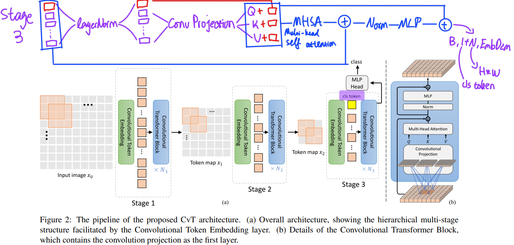
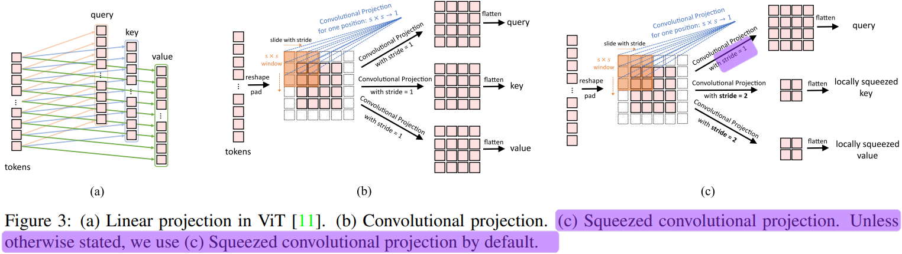
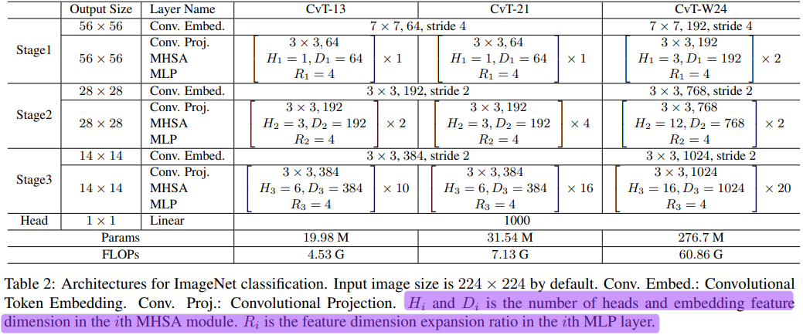
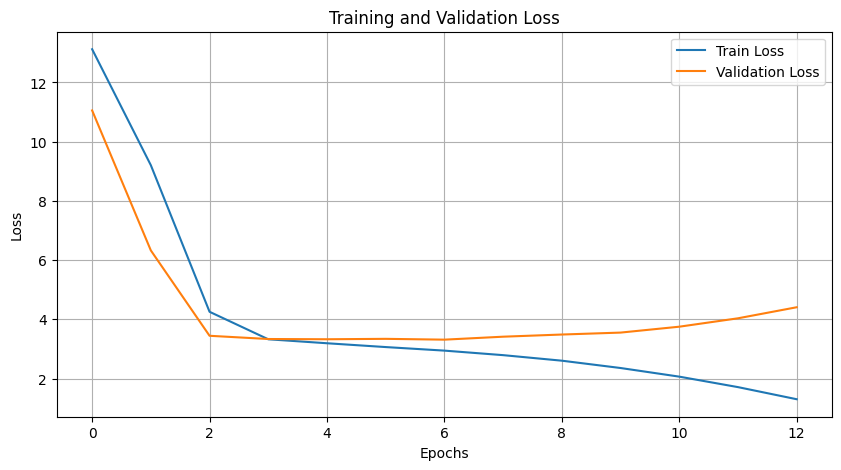

# CvT: Introducing Convolutions to Vision Transformers

This repository contains the implementation of the paper [CvT: Introducing Convolutions to Vision Transformers](https://arxiv.org/abs/2103.15808) using PyTorch.

## Model Architecture

The CvT model introduces convolutions to the Vision Transformer architecture. The overall architecture is shown below:

### Overall Workflow
<p align="center">
  
</p>

### Convolutional Projection
<p align="center">
  
</p>

The key components of CvT are:

*   **Convolutional Token Embedding**: This module reshapes the 2D input image into a sequence of 1D tokens, similar to ViT, but uses a convolutional layer instead of a linear projection. This allows the model to learn local spatial context.
*   **Convolutional Transformer Block**: This block replaces the linear projections in the multi-head attention (MHA) module with depth-wise separable convolutions. This allows the model to capture local spatial context and reduces the number of parameters.

The model architecture details are shown in the paper.

<p align="center">
  
</p>

## Dataset

This repository uses the [Oxford-IIIT Pet Dataset](https://www.kaggle.com/datasets/tomasfern/oxford-iit-pets). The dataset contains 37 species of dogs and cats, with 200 images for each species. The images have a large variation in scale, pose, and lighting. The dataset is split into training, validation, and test sets.

## Usage

To use this repository, you need to install the dependencies listed in `pyproject.toml`. You can do this by running:

```bash
poetry install
```

Then, you can run the `train.ipynb` notebook to train the model.

## Results

The learning curve for the CvT-13 model is shown below:

<p align="center">
  
</p>

## Issues

You can see the learning curve isn't in its most desirable shape. The paper first trains the model on HUGE datasets, then transfer it to smaller datasets, like the Oxford Pet dataset. However, I had to train this on my 6GB VRAM NVIDIA GPU, making that impossible. As a result, overfitting was un-avoidable. And loss didn't go down below 3.0.

## References

*   [Wu, Haiping, et al. "CvT: Introducing Convolutions to Vision Transformers." arXiv preprint arXiv:2103.15808 (2021).](https://arxiv.org/abs/2103.15808)
*   [Official Implementation by Microsfot](https://github.com/microsoft/CvT)